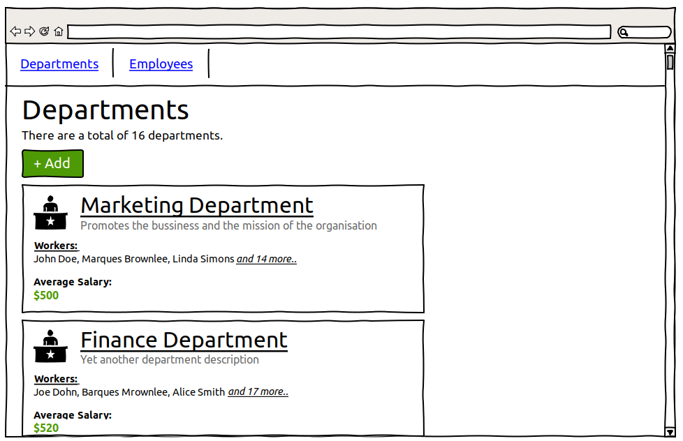
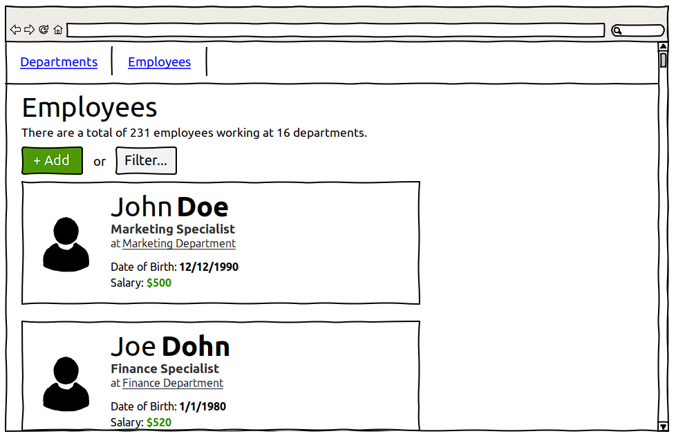

# Department App

## A simple web application for managing departments and employees. 

**The web application can:**
- display a list of departments
- display the average salary (calculated automatically) for each department
- display a list of employees in the departments
- display the salary for each employee
- search for employees born on a certain date or in the period between dates
- change (add / edit / delete) the above data

## **1. Homepage**

**Main scenario:**

* After the start of the application, the homepage is shown.
* User clicks on 
  * "View Departments..." to view the departments (2.1) 
  * "View Employees..." to view the employees (3.1) 

_Pic. 1. Homepage_

## **2. Departments**

### 2.1 Display list of departments

**Main scenario:**

* User clicks "Departments" on the navigation bar or "View Departments..." on the homepage (1)
* The list of departments is displayed
* User views the list of departments

**Add department scenario:**

* User clicks "Departments" on the navigation bar or "View Departments..." on the homepage (1)
* The list of departments is displayed
* User clicks on "+ Add" button and adds a department (2.2)

**Edit department scenario:**

* User clicks "Departments" on the navigation bar or "View Departments..." on the homepage (1)
* The list of departments is displayed
* User finds a department and hovers a mouse over it
* The "..." icon appears on the department's card
* User clicks "..." and chooses "Edit" option
* User edits the department (2.3)

**Delete department scenario:**

* User clicks "Departments" on the navigation bar or "View Departments..." on the homepage (1)
* The list of departments is displayed
* User finds a department and hovers a mouse over it
* The "..." icon appears on the department's card
* User clicks "..." and chooses "Delete" option
* User clicks "Delete" button on the confirmation window
* Department is deleted and the list of departments is shown

_Pic. 2.1.1. List of departments_

List consists of cards, each card represents a department.
Each card states department's name, short description, workers and average salary.

A number of existing departments in shown on the top of the page.
Under it, there is a button "+ Add", which takes a user to the department adding page (2.2)

Department's name is a link to filtered list of employees of this department (3.1). Text "and _X_ more..." is also a link to the filtered list.

If there are no departments, a label depicting this is shown.

If the mouse holds over a card, an icon "..." appears at the corner of the card.

_Pic. 2.1.2. Mouse holds over a card_

If the "..." icon is clicked, a context menu appears, with options "Edit" and "Delete".

_Pic. 2.1.3. Context menu_

* If the user clicks on the "Edit" option, they are redirected to department edit page (2.3).
* If the user clicks on the "Delete" option, a confirmation window is shown. The department's name and number of workers are stated.

In the confirmation dialog:

* After clicking "Delete", the department in deleted. All of its workers are deleted as well.
* After clicking "Cancel", confirmation window is closed.

_Pic. 2.1.4. Delete confirmation_

### 2.2 Adding a department

**Main scenario:**

* User clicks "+ Add" on the department list screen (2.1)
* The form for adding a department is displayed
* User enters department’s data and presses “Add” button;
* If any data is entered incorrectly, incorrect data messages are displayed;
* If entered data is valid, then the record is added to database;
* If an error occurs, then the error message is displayed
* If new department is successfully added, then list of departments with added department is displayed(2.1)

**Cancel operation scenario:**

* User clicks the “Add” button in the department list view mode;
* Application displays the form to enter department’s data;
* User enters client’s data and presses “Cancel” button;
* Data is not saved in the database, the list of departments (2.1) is displayed.

_Pic. 2.2. Adding a department_

When adding a client, the following details are entered:
* Name - Department's name
* Description - Brief department's description

Constraints for data validation:
* Name – unique, maximum length of 80 characters;
* Description  – maximum length of 300 characters;

### 2.3 Editing a department

**Main scenario:**

* In the departments list, user finds a department and hovers a mouse over it
* The "..." icon appears on the department's card
* User clicks "..." and chooses "Edit" option
* The department edit form is displayed
* User changes department’s data and presses the save button;
* If any data is entered incorrectly, incorrect data messages are displayed;
* If entered data is valid, then edited data is added to database;
* If error occurs, then error message is displaying;
* If department’s record is successfully edited, then list of departments (2.1) is displayed.

**Cancel operation scenario:**

* In the departments list, user finds a department and hovers a mouse over it
* The "..." icon appears on the department's card
* User clicks "..." and chooses "Edit" option
* The department edit form is displayed
* User enters client’s data and presses “Cancel” button;
* Data is not saved in the database, the list of departments (2.1) is displayed.

_Pic. 2.3. Editing a department_

### 2.4 Removing a department

**Main scenario:**

* The list of departments (2.1) is displayed
* User finds a department and hovers a mouse over it
* The "..." icon appears on the department's card
* User clicks "..." and chooses "Delete" option
* Application displays confirmation dialog
* User clicks "Delete" button in the confirmation dialog
* Department is deleted and the list of departments (2.1) is shown
* If error occurs, then error message is displayed

**Cancel operation scenario:**

* The list of departments (2.1) is displayed
* User finds a department and hovers a mouse over it
* The "..." icon appears on the department's card
* User clicks "..." and chooses "Delete" option
* Application displays confirmation dialog
* User clicks "Cancel" button in the confirmation dialog
* Department is not deleted from the database, the list of departments (2.1) is displayed.

_Pic. 2.4. Deleting a department (confirmation dialog)_

## **3. Employees**

### 3.1 Display list of employees

**Main scenario:**

* User clicks "Employees" on the navigation bar or "View Employees..." on the homepage (1)
* The list of employees is displayed
* User views the list of employees

**Add employee scenario:**

* User clicks "Employees" on the navigation bar or "View Employees..." on the homepage (1)
* The list of employees is displayed
* User clicks on "+ Add" button and adds an employee (3.2)

**Edit employee scenario:**

* User clicks "Employees" on the navigation bar or "View Employees..." on the homepage (1)
* The list of employees is displayed
* User finds an employee and hovers a mouse over it
* The "..." icon appears on the employee's card
* User clicks "..." and chooses "Edit" option
* User edits the employee (3.3)

**Delete employee scenario:**

* User clicks "Employees" on the navigation bar or "View Employees..." on the homepage (1)
* The list of employees is displayed
* User finds an employee and hovers a mouse over it
* The "..." icon appears on the employee's card
* User clicks "..." and chooses "Delete" option
* User clicks "Delete" button on the confirmation window
* Employee is deleted and the list of employees is shown

**Filter employees scenario:**

* User clicks "Employees" on the navigation bar or "View Employees..." on the homepage (1)
* The list of employees is displayed
* User clicks "Filter..." button
* The window with filters is displayed
* User ticks the filters they want to use
* User enters the necessary information for the filters
* User clicks "Filter"
* User views the filtered list of employees
* If the filters were already applied, they are replaced with new ones

**Cancel filter scenario:**

* User clicks "Employees" on the navigation bar or "View Employees..." on the homepage (1)
* The list of employees is displayed
* User clicks "Filter..." button
* The window with filters is displayed
* User ticks the filters they want to use
* User can enter the information for the filters
* User clicks "Cancel"
* User views the current list of employees
* If the filters were already applied, they remain

_Pic. 3.1.1. List of employees_

List consists of cards, each card represents an employee.
Each card states employee's name, job, department, date of birth and salary.
Employee's department is a link to filtered list of employees of theirs department (3.1).

If the list is requested with filters, it contains only the employees who match it. 

A number of employees in shown on the top of the page, with the number of departments they work in.

Under it, there is a button "+ Add", which takes a user to the employee adding page (3.2), and a button "Filter", which displays a filter dialog.

_Pic. 3.1.2. Filters dialog_

Filter dialog consists of ticking boxes, each representing a filter, with a label and input fields.

* If the box is ticked, its filter should be applied after hitting "Filter".
* If the second date field is not filled, only employees born on the first field's date will be shown.

If there are no employees, a label depicting this is shown.

If the mouse holds over a card, an icon "..." appears at the corner of the card.

_Pic. 3.1.3. Mouse holds over a card_

If the "..." icon is clicked, a context menu appears, with options "Edit" and "Delete".

_Pic. 3.1.4. Context menu_

* If the user clicks on the "Edit" option, they are redirected to employee edit page (3.3).
* If the user clicks on the "Delete" option, a confirmation window is shown. The employee's name is stated.

In the confirmation window:

* After clicking "Delete", the employee in deleted. Its department is not deleted.
* After clicking "Cancel", confirmation window is closed.

_Pic. 3.1.5. Delete confirmation_

### 3.2 Adding an employee

**Main scenario:**

* User clicks "+ Add" on the employee list screen (3.1)
* The form for adding an employee is displayed
* User enters employee’s data and presses “Add” button
* If any data is entered incorrectly, incorrect data messages are displayed
* If entered data is valid, then the record is added to database
* If an error occurs, then error message is displayed
* If new employee is successfully added, then the **unfiltered** list of employees with added records is displayed (3.1)

**Cancel operation scenario:**

* User clicks the “Add” button in the employee list view mode;
* Application displays the form to enter employee’s data;
* User enters client’s data and presses “Cancel” button;
* Data is not saved in the database, the current list of employees (3.1) is displayed.

_Pic. 3.2. Adding an employee_

When adding a client, the following details are entered:
* Name - Employee's full name
* Department - Employee's department (choice between existing departments)
* Job - Employee's job in the department
* Date of Birth - Employee's date of birth
* Salary, $ - Employee's monthly salary in US dollars

Constraints for data validation:
* Name – maximum length of 80 characters;
* Job  – maximum length of 100 characters;
* Date of Birth  – date, before current day;
* Salary – a positive integer;

### 3.3 Editing an employee

**Main scenario:**

* In the employees list, user finds an employee and hovers a mouse over it
* The "..." icon appears on the employee's card
* User clicks "..." and chooses "Edit" option
* The employee edit form is displayed
* User changes employee’s data and presses the save button;
* If any data is entered incorrectly, incorrect data messages are displayed;
* If entered data is valid, then edited data is added to database;
* If error occurs, then error message is displaying;
* If employee’s record is successfully edited, then list of employees (3.1) is displayed.

**Cancel operation scenario:**

* In the employees list, user finds an employee and hovers a mouse over it
* The "..." icon appears on the employee's card
* User clicks "..." and chooses "Edit" option
* The employee edit form is displayed
* User enters client’s data and presses “Cancel” button;
* Data is not saved in the database, the list of employees (3.1) is displayed.

_Pic. 3.3. Editing an employee_

### 3.4 Removing an employee

**Main scenario:**

* The list of employees (3.1) is displayed
* User finds an employee and hovers a mouse over it
* The "..." icon appears on the employee's card
* User clicks "..." and chooses "Delete" option
* Application displays confirmation dialog
* User clicks "Delete" button in the confirmation dialog
* Employee is deleted and the list of employees (3.1) is shown
* If error occurs, then error message is displayed

**Cancel operation scenario:**

* The list of employees (3.1) is displayed
* User finds an employee and hovers a mouse over it
* The "..." icon appears on the employee's card
* User clicks "..." and chooses "Delete" option
* Application displays confirmation dialog
* User clicks "Cancel" button in the confirmation dialog
* Employee is not deleted from the database, the list of employees (3.1) is displayed.

_Pic. 3.4. Deleting an employee (confirmation dialog)_
